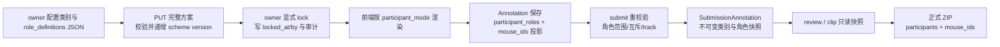

# 行为类别方案与参与对象角色化扩展设计

> 状态：**当前 `feature/category-role-schema@933b805` 已通过 merge `6e2825d` 集成 `origin/main@b40fff3` 的完整分工 PR #2 与媒体修复，并由 `6afc126`、`02fe454`、`933b805` 完成后续修复；Oracle 最终确认实现问题关闭。联合后端全量 `516 passed, 3 skipped, 1 warning`，5 项真实 FFmpeg/ffprobe 集成测试实际通过，前端 build 62 modules。待 push、创建 PR2、进入 `main` 与部署**。
>
> 日期：2026-08-22
>
> 文件名及历史设计脉络保持不变以避免既有链接失效。实现已在本地 feature 分支提交，并已集成当前 `origin/main` 基线，但未 push、未创建 PR2、未进入 `main`、未部署；本文的“已实现”不能解释为主分支、远端或服务器现状。

## 1. 背景与实现证据

系统允许 owner 在开始标注前配置完整行为类别方案，并为部分行为类别定义参与对象角色。方案生命周期统一为“配置中 → 永久锁定”，不采用逐类别解锁或按使用情况变化的状态机。

独立 feature worktree 已完成端到端实现：

- 创建表单默认预填 RFID-CV 规范 12 类完整方案且允许编辑；提交 `POST /api/projects` 时仍须显式携带当前非空完整方案，后端不隐式套用默认值。Project、owner membership、规范化类别和初始 replace audit 原子创建，初始 version=0 且保持未锁定，创建后仍需复核。
- `seed_demo.py` 仅为演示流程受控建立 12 类方案；其 Project、owner、类别、replace/lock audit 与永久锁定同事务提交。
- 类别方案聚合 GET/PUT/lock/audit 均为 active owner-only；runtime categories 仅在锁定后供 active 项目成员读取。
- `Project`、`BehaviorCategory`、`Annotation`、`SubmissionAnnotation` 与方案审计已增加 0013 所需字段、JSON 和数据库保护。
- 角色化草稿、提交、Review、Clips、正式 ZIP `participants` 与 legacy 兼容输出均已接通；`tracks.json` 继续只保存轨迹/姿态事实。
- Split、Merge、整轨忽略、undo 与 detection replacement 已按角色冲突契约处理；confirmed replacement 以 `annotations_must_be_refetched=true` 要求调用方重取 Annotation。
- 前端已实现方案配置/锁定、固定角色槽位、草稿恢复、角色状态和 Review/Clips 摘要。当前 `replaceDetectionImport` 没有 UI 调用点；未来调用者必须由页面状态 owner 执行结构化 refetch，不得解析自然语言提示。
- `mouse_ids` 仍是全部参与对象的兼容投影，其顺序不表达 actor/target；角色语义只来自显式角色 JSON/Submission 快照。

## 2. 审阅指南：如何阅读本文

### 2.1 五类标记

| 标记 | 含义 | 审阅时应关注什么 |
|---|---|---|
| 基线已有 | 基线 `dce9d18` 已有，可从历史路径核对 | 用于理解加法改动。 |
| feature 已提交 | 当前联合分支提交链截至 `933b805`，但尚未进入 `main`、远端或服务器 | 不要误当作已合入主分支或已部署。 |
| 保留兼容 | 旧字段继续存在，但可能从 authority 变为投影 | 检查新旧消费者能否同时解释。 |
| Submission/导出专用 | 只在提交不可变副本或正式文件中保存 | 不应被草稿实时数据覆盖。 |
| 发布边界 | 实现完成但仍需人工验收、提交、集成或部署 | 不得把自动验收扩大解释为生产验收。 |

### 2.2 一句话总览

**类别方案在 `Project` 上锁定；类别定义在 `BehaviorCategory`；草稿实际分配在 `Annotation`；提交后的权威副本在 `SubmissionAnnotation`；正式 ZIP 只读 Submission 快照。**

后文先解释业务含义，再给技术字段。JSON 示例用于说明稳定业务结构；最终接口路径和物理字段以 feature 实现及 backend README 为准。

## 3. 已确认的项目级生命周期

### 3.1 配置中

- 创建表单默认预填 RFID-CV 规范 12 类完整方案但可编辑，类别未完整前禁止提交；普通项目必须将当前至少一个包含名称、分组、非空颜色、参与对象模式及对应数量/角色的完整类别方案随创建请求显式、原子提交，后端不隐式套用默认值。
- 创建成功时方案 version=0、未锁定；owner 进入管理页复核后另行永久锁定。非法创建请求不留下 Project、membership、category 或 audit。
- 只有 active owner 可读取、保存、锁定及审计完整方案；其他 active 成员仅在锁定后读取 runtime categories。
- owner 可新增、删除、改名、修改分组/颜色/对象数量、调整类别排序，以及配置参与对象模式和角色定义；角色顺序另按 §9.1 的创建先后规则由系统维护。
- 已持久化的普通项目不得以零类别方案作为当前契约；即使用户清空预填方案，也必须补全至少一个类别后才能提交。
- 未锁定项目禁止创建、更新或删除任何 Annotation；Annotation 写入不能隐式锁定。

### 3.2 显式永久锁定

- owner 必须独立执行“锁定类别方案并开始标注”，并确认最终类别/角色摘要及永久不可修改警告。
- 进入页面、查看视频或尝试创建第一条 Annotation 都不得触发锁定。
- 锁定后类别集合、名称、分组、颜色、总对象数量、顺序、`participant_mode` 和 `role_definitions` 全部永久只读，包括从未使用的类别。
- 删除草稿、删除全部标注、withdraw、reject、supersede 均不解锁；不提供日常解锁。

### 3.3 项目级并发与锁定事务

- 完整方案保存与锁定共用 `Project.category_scheme_version` CAS。
- 保存成功原子替换完整方案并递增项目级版本；不设置每类别版本。
- 锁定要求 owner、未锁定、`expected_version` 匹配、至少一类、完整方案合法，且正常新流程无 Annotation/Submission。
- 首次锁定同事务写锁定人、锁定时间、锁定审计和最终方案摘要/hash。
- 重复锁定幂等返回首次结果，不改时间/人、不重复审计。
- 保存先成功时，旧版本锁定请求失败并要求重新确认；锁定先成功时，并发保存返回 `SCHEME_LOCKED`。

## 4. 当前结构与目标结构总览

### 4.1 Project：方案级状态与锁

业务含义：Project 决定“能否继续配置类别”和“能否开始写标注”，是类别方案的聚合根。

| 实体/字段 | 当前状态 | 目标状态 | 写入时机 | 锁定后能否改变 | 兼容与审阅要点 |
|---|---|---|---|---|---|
| `Project.category_scheme_version` | 基线不存在 | feature 已新增非负整数项目级版本 | 每次完整方案保存成功后递增 | 锁定后不再用于方案写入 | 保存与 lock 使用同一 expected version。 |
| `Project.category_scheme_locked_at` | 基线不存在 | feature 已新增可空锁定时间 | 首次显式锁定 | 否；不得清空或覆盖 | 与 locked_by 必须同空同非空。 |
| `Project.category_scheme_locked_by` | 基线不存在 | feature 已新增可空锁定 owner | 首次显式锁定 | 否；不得清空或覆盖 | 记录真实操作者，不能伪造 owner 点击。 |

### 4.2 BehaviorCategory：锁定前配置的类别定义

业务含义：每行描述一个可选行为类别；整个集合一起保存、一起锁定。

| 实体/字段 | 当前状态 | 目标状态 | 写入时机 | 锁定后能否改变 | 兼容与审阅要点 |
|---|---|---|---|---|---|
| `id` / `project_id` | 当前已实现，标识类别及所属项目 | 保留 | 配置保存 | 否 | 项目边界和外键继续有效。 |
| `name` | 当前已实现 | 保留；trim、非空、最长 64、项目内忽略英文大小写唯一 | 锁定前配置 | 否 | 内部空白保留。 |
| `group` | 当前已实现 | 保留；owner 可选已有分组或输入新分组 | 锁定前配置 | 否 | 正式提交另存 group 快照。 |
| `color` | 当前已实现 | 保留；可自动生成并由 owner 修改 | 锁定前配置 | 否 | 仅展示元数据，不是角色语义。 |
| `sort_order` | 当前已实现 | 保留；完整方案中表达类别顺序 | 锁定前配置 | 否 | 随整个方案原子保存。 |
| `is_active` | 当前已实现 | 仅兼容保留 | 新流程不写停用/恢复 | 否 | 新流程没有停用、恢复或 inactive 筛选状态机。 |
| `mouse_count_min` / `mouse_count_max` | 基线已有，总参与对象数量范围 | 保留；role_based 时由 per-role 范围派生 | 锁定前配置 | 否 | 任一角色 max 为 null 时总 max 为 null，否则求和。 |
| `participant_mode` | 基线不存在 | feature 已新增 `unordered|role_based` | 锁定前配置 | 否 | 同一类别不混用两种记录模式。 |
| `role_definitions` | 基线不存在 | feature 已新增 JSON；系统生成稳定 key、自定义 name、per-role min/max、系统维护的 `role_sort_order` | 锁定前配置 | 否 | unordered 时必须为空；角色按创建先后追加并在保存时规范化为连续顺序，不建独立角色表。 |

### 4.3 Annotation：可编辑草稿及实际参与对象

业务含义：Annotation 保存某一时间段实际有哪些参与对象；角色化类别还要保存每个对象承担的角色。

| 实体/字段 | 当前状态 | 目标状态 | 写入时机 | 锁定后能否改变 | 兼容与审阅要点 |
|---|---|---|---|---|---|
| `category_id` | 当前已实现 | 保留，引用已锁定类别 | 创建/编辑草稿 | 可随草稿业务规则编辑 | 项目未锁定时禁止 Annotation 写。 |
| `mouse_ids` | 当前已实现且当前为参与对象 authority | 保留兼容 | 创建/编辑草稿 | Annotation 可编辑阶段可变 | unordered 时仍是 authority；role_based 时变为角色分配的去重升序并集投影。 |
| `mouse_id_status` | 当前已实现，表示现有参与对象有效性 | 保留 | 现有重校验链路 | 可由重校验更新 | 不直接假定它能完整承载未来角色待补全状态。 |
| `participant_roles` | 基线不存在 | feature 已新增 JSON：`role_key -> track_id[]` | 角色化草稿创建/编辑 | Annotation 可编辑阶段可变 | role_based 时是角色 authority。 |
| `participant_status` | 基线不存在 | feature 已新增 `valid|needs_participants` | 保存或重校验角色草稿时 | 可随补选和重校验变化 | 与表示 Track 有效性的 `mouse_id_status` 分开。 |

非角色化类别中 `participant_mode=unordered`、`role_definitions=[]`，继续只按 `mouse_ids` 集合工作。角色化类别中 `participant_roles` 是 authority，`mouse_ids` 必须由其计算，不允许客户端分别提交两套相互矛盾的数据。

### 4.4 SubmissionAnnotation：提交后不可变权威副本

业务含义：SubmissionAnnotation 固定一次提交时审核和导出必须看到的类别与参与对象语义，不再读取可编辑草稿补解释。

| 实体/字段 | 当前状态 | 目标状态 | 写入时机 | 写入后能否改变 | 兼容与审阅要点 |
|---|---|---|---|---|---|
| `category_id` | 当前已实现 | 保留 | submit | 否 | 外键 RESTRICT 继续作为防御。 |
| `category_name` | 当前已实现快照 | 保留 | submit | 否 | 正式 category 目录和 annotation.json 行为名读取它。 |
| `mouse_ids` | 当前已实现快照 | 保留兼容 | submit | 否 | 角色化时为角色分配并集快照。 |
| `category_group` | 基线不存在 | feature 已新增类别分组快照（legacy 可空） | submit | 否 | 正式 group 目录读取它。 |
| `role_definitions_snapshot` | 基线不存在 | feature 已新增 JSON | submit | 否 | 冻结 role_key、role_name、范围和顺序。 |
| `participant_roles_snapshot` | 基线不存在 | feature 已新增 JSON | submit | 否 | 保存该条标注 role → track IDs；审核/导出 authority。 |

### 4.5 方案审计与正式文件

| 实体/字段 | 当前状态 | 目标状态 | 写入时机 | 后续能否改变 | 兼容与审阅要点 |
|---|---|---|---|---|---|
| `category_scheme_audits` | 基线不存在 | feature 已新增完整方案前后快照、操作者、时间、版本、摘要/hash | 每次 PUT 与首次 lock 同事务 | 只追加 | owner-only 查询；重复 lock 不重复记录。 |
| 正式 `annotation.json` 的 `behavior/confidence/frame_range/time_range` | 当前已实现 | 保留现有业务含义 | 导出时从 Submission 快照生成 | 导出输入冻结 | 新增角色字段不得破坏这些现有字段。 |
| 正式 `annotation.json.mouse_ids` | 当前已实现 | 保留兼容 | 导出时从 Submission 快照生成 | 导出输入冻结 | 旧消费者仍能获得全部参与对象。 |
| 正式 `annotation.json.participants` | 基线不存在 | feature 已新增数组，每项含 role_key、role_name、track_ids | 导出时从 Submission 快照生成 | 导出输入冻结 | 与 mouse_ids 并存。 |
| 正式 `tracks.json` | 当前已实现逐帧 track/姿态事实 | 结构保持不变 | 导出时从 DetectionSnapshot 生成 | 导出输入冻结 | 不复制角色，不是行为角色 authority。 |

## 5. 建议 JSON 结构示例

> 以下均为设计示例，不代表最终 API 路径、请求包络、数据库物理列名或默认类别。示例中的数组顺序不用于推断角色。

### 5.1 非角色化类别

```json
{
  "name": "静止",
  "group": "个体行为",
  "color": "#4363D8",
  "sort_order": 0,
  "mouse_count_min": 1,
  "mouse_count_max": 1,
  "participant_mode": "unordered",
  "role_definitions": []
}
```

该类别的 Annotation 继续由 `mouse_ids` 表示无序参与对象集合。

### 5.2 角色化类别及角色定义

```json
{
  "name": "攻击行为示例",
  "group": "社交行为",
  "color": "#E6194B",
  "sort_order": 1,
  "mouse_count_min": 2,
  "mouse_count_max": 5,
  "participant_mode": "role_based",
  "role_definitions": [
    {
      "key": "attacker",
      "name": "攻击者",
      "min_count": 1,
      "max_count": 2,
      "role_sort_order": 0
    },
    {
      "key": "recipient",
      "name": "被攻击者",
      "min_count": 1,
      "max_count": 3,
      "role_sort_order": 1
    }
  ]
}
```

外层 `sort_order` 是行为类别在项目类别列表中的顺序，继续对应现有 `BehaviorCategory.sort_order`；角色定义中的 `role_sort_order` 是该角色在本类别角色列表、标注控件和审核展示中的顺序。`role_sort_order` 由系统按 owner 创建角色的先后维护：新角色追加到末尾，删除后重新新增也追加到末尾，方案保存时规范化为从 0 开始的连续顺序。owner 不输入顺序数字，标注者也不决定角色先后。二者作用域不同，不能混用，也不能由其中一个推导另一个。

### 5.3 完整角色分配 Annotation

```json
{
  "category_id": 41,
  "participant_roles": {
    "attacker": [12],
    "recipient": [27, 31]
  },
  "mouse_ids": [12, 27, 31]
}
```

`participant_roles` 是角色 authority；`mouse_ids` 是全部角色 track ID 的去重升序并集。track 12 不能再出现在 `recipient`。

### 5.4 未补全角色草稿

```json
{
  "category_id": 41,
  "participant_roles": {
    "attacker": [12],
    "recipient": []
  },
  "mouse_ids": [12]
}
```

该草稿允许保存，`participant_status=needs_participants`；由于 `recipient.min_count=1`，它不能提交审核。

### 5.5 Submission 快照概念示例

```json
{
  "category_id": 41,
  "category_name": "攻击行为示例",
  "category_group": "社交行为",
  "role_definitions_snapshot": [
    {"key": "attacker", "name": "攻击者", "min_count": 1, "max_count": 2, "role_sort_order": 0},
    {"key": "recipient", "name": "被攻击者", "min_count": 1, "max_count": 3, "role_sort_order": 1}
  ],
  "participant_roles_snapshot": {
    "attacker": [12],
    "recipient": [27, 31]
  },
  "mouse_ids": [12, 27, 31]
}
```

快照字段名只是设计名。核心要求是：提交后能脱离实时类别和草稿，独立解释角色定义及实际分配。

### 5.6 正式 `annotation.json`

```json
{
  "behavior": "攻击行为示例",
  "mouse_ids": [12, 27, 31],
  "participants": [
    {"role_key": "attacker", "role_name": "攻击者", "track_ids": [12]},
    {"role_key": "recipient", "role_name": "被攻击者", "track_ids": [27, 31]}
  ],
  "confidence": "certain",
  "frame_range": {"start": 0, "end": 89},
  "time_range": {"start": 0.0, "end": 3.0}
}
```

正式 `tracks.json` 不增加角色字段；通过相同 track ID 与 `participants[].track_ids` 关联。

## 6. 权威来源与派生字段

本节描述 feature worktree 已实现的 authority；当前分支已集成 `origin/main@b40fff3`，但主分支和服务器尚不具备 category 结构。

| 阶段/对象 | Authority（权威来源） | 派生或兼容字段 | 不应作为 authority 的内容 |
|---|---|---|---|
| 配置中类别方案 | `BehaviorCategory` 完整集合 + `Project.category_scheme_version` | 页面表单和方案摘要 | 单个类别的局部缓存。 |
| 锁定后类别定义 | `BehaviorCategory` + `Project.category_scheme_locked_at/by` | 只读页面和方案 hash | Annotation 是否存在、类别是否使用。 |
| 非角色化草稿 | `Annotation.mouse_ids` | UI 选中状态 | 点击顺序。 |
| 角色化草稿 | `Annotation.participant_roles` | `Annotation.mouse_ids` 去重升序并集 | mouse_ids 顺序或平行数组。 |
| 提交与审核 | 不可变 `SubmissionAnnotation` 类别/角色快照 | 审核页面展示 | 实时 BehaviorCategory、可编辑 Annotation。 |
| 正式 ZIP | 入队冻结的 approved Submission authority | `annotation.json`、目录和 tracks 文件 | 当前草稿或实时类别。 |
| `tracks.json` | DetectionSnapshot 恢复出的逐帧 track/姿态事实 | 与 participants 通过 track ID 关联 | 行为角色名称或角色分配。 |

### 6.1 强制不变量

1. 角色化 Annotation 中每个 role key 都必须存在于锁定的 `role_definitions`。
2. 每个角色的 track ID 列表内部唯一。
3. 同一 track ID 不得出现在两个角色中。
4. `mouse_ids` 必须等于所有角色列表的去重升序并集。
5. 提交前每个角色必须满足 owner 锁定的 per-role min/max，所有 track 必须有效且覆盖标注区间要求。
6. 项目锁定后 `participant_mode` 和 `role_definitions` 永久不变。
7. 非角色化类别的 `role_definitions` 为空，`mouse_ids` 继续是参与对象 authority。

## 7. 兼容策略

### 7.1 数据和字段兼容

- 数据库采用加法迁移：新增 Project 锁定字段、类别角色 JSON、Annotation 角色 JSON、Submission 快照和审计存储。
- 不复用或改变现有 `mouse_ids` 的“全部参与对象集合”含义。
- 非角色化路径完全沿用当前 `mouse_ids` 集合语义。
- 角色化路径使用显式 JSON 映射；不使用平行数组，不用排序、数值大小或点击顺序表达角色。
- 旧代码/旧消费者仍可读取 `mouse_ids` 获得全部参与对象，但无法看到角色；正式 ZIP 同时提供 `mouse_ids` 和 `participants`。
- 正式 role_based 写请求只提交完整 `participant_roles`，后端派生 `mouse_ids`；响应兼容返回两者。legacy 输出保留 `mouse_ids` 并增加角色字段。

### 7.2 项目和数据边界

- feature 中普通项目必须与非空完整方案原子创建，初始 version=0、未锁定；创建与后续 PUT 共用 `category_scheme_service`，新增 category id/role key 由服务端生成。
- 受控 `seed_demo.py` 的 Project、owner、12 类、replace/lock audit 与永久锁定同事务提交，不构成普通项目创建接口的隐式默认值。
- 用户已确认现有项目都是演示数据，计划在实施/部署前清理；当前尚未清理，实际删除必须另行确认。
- 不为旧 Annotation/Submission 猜测或回填角色，也不设计旧业务数据角色迁移路径。
- 若切换前仍发现项目或标注数据，必须阻断并重新确认，不能静默当作已清理。

### 7.3 发布与回滚风险

- schema 升级后，旧应用不了解方案锁和角色 authority，可能绕过锁定门禁或覆盖派生字段。
- 上线必须把数据库迁移、后端、前端作为一次协调切换；不得让旧后端继续写入已采用新锁定结构的数据库。
- 回滚不能只回滚应用而保留可被旧应用误写的新 schema；备份、停写窗口、回滚版本组合和恢复演练在实施计划中细化。
- 数据库 trigger/约束必须阻止旁路修改锁定后的类别与角色定义，并阻止锁定字段清空/覆盖。

## 8. 端到端字段流转

下图和编号描述 feature worktree 已实现的流程；该流程尚未通过 PR2 进入 `main` 或服务器。



文字流程：

1. owner 在配置中定义类别；角色化类别写 `participant_mode=role_based` 和 `role_definitions` JSON。
2. PUT 发送完整方案及 expected version；后端整体规范化、校验并原子保存，项目级版本递增。
3. owner 查看最终摘要并显式 lock；锁定字段和一次锁定审计同事务写入。
4. 锁定后前端才开放 Annotation 写入，并按 participant_mode 渲染无序集合或角色槽位。
5. 角色化草稿保存 `participant_roles`；后端计算/核对 `mouse_ids` 并集。缺少必需角色时允许保存但标记不完整。
6. submit 重新校验 per-role min/max、角色 key、列表唯一、跨角色互斥、mouse_ids 并集及 track 有效性。
7. 校验通过后创建不可变 SubmissionAnnotation，冻结类别名称/分组、角色定义、实际分配和 mouse_ids。
8. 审核与片段库读取 Submission authority，不回读实时草稿解释角色。
9. 正式导出生成 participants + mouse_ids；tracks.json 保持纯轨迹/姿态事实。
10. Split/整轨忽略若影响角色分配则拒绝；Merge 仅在唯一且无跨角色冲突时自动替换，undo 按 before/after image 与当前值校验恢复。

## 9. 角色选择交互设计（R15 已确认）

本节是面向人工审阅和后续实现的 UX 契约。目标是在不为进入角色选择增加弹窗步骤、不让标注者决定角色顺序的前提下，始终明确“下一次点击会把 track 分给谁”，并保留低成本纠错能力。具体组件尺寸、颜色值、图标和最终快捷键不在本轮冻结。

### 9.1 owner 创建角色与固定顺序

- owner 新建角色时，系统将其追加到当前角色列表末尾并自动分配 `role_sort_order`；owner 不填写顺序数字。
- 不提供角色拖拽排序或“谁先选择”的额外设置。该收口符合“按创建先后决定”且减少配置注意力；如顺序错误，锁定前应删除并按正确顺序重建。
- 删除后重新新增的角色视为新角色，追加到末尾，不复用被删角色的位置。完整方案保存时将 `role_sort_order` 规范化为从 0 开始的连续整数。
- `role_sort_order` 是系统维护字段，也是角色栏、标注顺序门禁、审核与快照展示的唯一角色顺序来源；它不是标注者决策，也不得从 track 点击顺序推断。

### 9.2 固定角色栏与状态表达

- 选中 `role_based` 类别后，参与对象区域直接显示按 `role_sort_order` 排列的固定角色栏/角色槽位，并自动激活第一个角色；不出现额外弹窗，也不要求标注者先选择角色顺序。
- 每个槽位至少显示：角色名、当前已选数、`min_count/max_count`、当前激活/完成/未完成状态，以及已分配的 track ID chips。无上限可显示为“已选 n / 至少 min”，有限范围可显示为“已选 n / min–max”。
- 当前激活状态必须同时有文字或明确图标及视觉强调；完成、未完成、锁定、达到上限也必须有文字/图标或可读说明，颜色不能是唯一状态表达。
- 角色栏应保持稳定、紧凑，不用自动跳动、轮播或高频提示争夺注意力。track 列表附近应持续显示“当前分配给：角色名”，使点击结果在视线范围内可预期。

### 9.3 首次顺序门禁与手动切换

- 第一个角色初始解锁并激活。点击已解锁角色槽位只切换当前激活角色，不改变已有分配。
- 不自动前进：角色达到 `min_count` 或 `max_count` 后都不自动切换，标注者必须主动点击另一个已解锁槽位。
- 为兼容“必须先选固定角色再选另一个”与“可手动回退纠错”，采用**首次向后推进受门禁、解锁后自由往返**：某角色首次进入前，其 `role_sort_order` 之前的所有角色都必须达到各自 `min_count`；`min_count=0` 自动视为满足。
- 槽位尚未解锁时仍可见但不可激活，并显示简短原因，例如“先完成攻击者（至少 1）”。不要让用户通过另一个控件选择谁先。
- 角色一旦在本次编辑中解锁，之后即使纠错使前序角色低于 min，也保持可往返，不清空后续角色、不强迫当前角色切换。重新打开草稿时，已有分配的后序角色视为已进入并允许回访；其他尚未进入的后序角色继续按前序 min 门禁。

### 9.4 track 分配、上限与跨角色互斥

- 点击未分配 track 时，总是加入**当前激活角色**；系统不得因点击 track、角色达到 min/max 或出现错误而自动改变当前角色。
- 当前角色达到 `max_count` 后不再接受新增。角色槽位及 track 区域持续显示稳定的“已达上限”状态；再次尝试新增时给就地提示，但不弹出重复打断式通知。`max_count=null` 时无此上限门禁。
- 同一 track 已属于其他角色时，不得静默移动。推荐采用一次明确的“移至当前角色”确认：就地提示“Track 12 已分配给攻击者”，提供“取消”和“移至被攻击者”。确认后以一个原子操作从原角色移除并加入当前角色；若当前角色已达 max，则不提供移动确认并解释原因。
- 推荐明确移动确认而非强制“先移除再添加”，因为它既保留跨角色互斥和防误触，又减少纠错步骤。移动后若原角色低于 min，只将其标为未完成；不回滚移动、不清空后续角色，也不自动切换当前角色。

### 9.5 纠错、类别切换与草稿恢复

- 每个已分配 track chip 提供可聚焦、带可访问名称的移除按钮或等价明确操作。移除仅影响该 track；低于 min 时对应角色立即标记为未完成。
- 移除、移动或变为未完成都不清空其他角色分配，也不自动改变当前激活角色。未补全状态允许继续编辑和保存草稿。
- 当已有任一角色分配时切换类别，必须先明确确认将清除当前类别的角色分配；取消则保持原类别及分配。不得静默丢失，不要求对从未产生角色分配的类别切换增加确认。
- 重新打开角色化草稿时恢复每个角色的分配。默认激活按 `role_sort_order` 排列的第一个未达到 `min_count` 的角色；若全部满足，则激活第一个角色。恢复不得根据上次 track 点击顺序重排角色。

### 9.6 保存、提交与校验反馈

- 保存草稿始终允许通过角色完整性这一层校验；只要满足现有基本保存门槛（如合法时间区间、已选类别等），角色未达到 min 也不能阻断保存。
- 保存前后应给一条紧凑摘要，例如“草稿可保存；被攻击者还需 1 个 track”，并在对应槽位标记未完成；不为每个缺项连续弹窗。
- 提交审核必须重新校验所有角色 key、每角色 min/max、角色内唯一、跨角色互斥、`mouse_ids` 并集及 track 有效性。任一失败即阻断提交，并把摘要与具体角色/track 问题关联起来。

### 9.7 键盘、可访问性与移动端

- 角色槽位必须可聚焦并可用键盘激活；左右键切换或显式角色快捷键属于实施建议，不在本轮固定键位。实施时先核对现有类别、参与对象和播放快捷键，不得抢占或改变既有键位。
- 当前角色、完成/未完成、锁定、达到上限和错误状态应有可读文字、图标及适当 ARIA 状态/说明；操作结果通过可感知但不过度打断的状态消息反馈。
- 移动端不依赖 hover。角色槽位可采用横向滚动的固定顺序栏或紧凑纵向列表，但必须保持当前角色和分配摘要可见、触控目标可操作，且不能因窄屏改变角色顺序。

### 9.8 状态机与操作流程

| 当前状态 | 用户操作 | 门禁/系统结果 | 当前角色是否变化 |
|---|---|---|---|
| 初次选择 role_based 类别 | 无额外操作 | 按 `role_sort_order` 显示槽位并激活第一个角色 | 变为第一个角色 |
| 后序角色未解锁 | 点击后序槽位 | 前序全部达到 min 才解锁；否则保留原角色并提示缺项 | 门禁失败时不变 |
| 后序角色已解锁 | 点击任一已解锁槽位 | 允许自由往返纠错 | 变为所点角色 |
| 当前角色未达 max | 点击未分配 track | track 加入当前角色 | 不变 |
| 当前角色已达 max | 点击未分配 track | 拒绝新增并持续显示“已达上限” | 不变 |
| track 属于其他角色 | 点击该 track | 显示“取消 / 移至当前角色”；确认后原子移动 | 不变 |
| 角色内已有 track | 点击 chip 的移除操作 | 仅移除该 track；必要时角色变为未完成 | 不变 |
| 角色未满足 min | 保存草稿 | 保存可继续，并显示缺项摘要 | 不变 |
| 任一角色或 track 校验失败 | 提交审核 | 阻断并定位问题 | 不自动改变 |

**“攻击者 → 被攻击者”示例：** owner 先创建“攻击者”（min=1、max=2），再创建“被攻击者”（min=1、max=3），因此两者的 `role_sort_order` 分别为 0、1。标注者选择该类别后自动处于“攻击者”；在攻击者仍为 0 时，“被攻击者”可见但锁定。将 Track 12 分给攻击者后，被攻击者解锁，但页面仍停留在攻击者；标注者手动点击被攻击者，再选择 Track 27。之后可随时回到攻击者移除或替换 Track 12；即使攻击者暂时降到 0，被攻击者的 Track 27 仍保留且槽位仍可回访，草稿可保存但提交被阻断，直到攻击者重新满足 min。

### 9.9 本轮人工审阅重点

- 核对角色顺序是否在 owner 创建、方案保存、标注、草稿恢复、审核和快照展示中都只读取系统维护的 `role_sort_order`。
- 核对任何 track 点击、达到阈值、移除或校验失败都不会自动切换角色；首次向后门禁与解锁后往返同时成立。
- 核对跨角色移动必须明确确认，类别切换不会静默清除分配，草稿保存与提交门槛有清晰区别。
- 核对状态不只靠颜色或 hover，且角色栏在桌面和移动端都不过度抢占标注注意力。

## 10. 最小 API、审计与数据库保护

### 10.1 聚合 API

| 能力 | 权限与输入 | 计划契约 |
|---|---|---|
| GET 完整方案 | active owner-only | 返回版本、锁定状态/操作者/时间及完整类别/角色方案。 |
| PUT 完整方案 | owner + expected version | 仅配置中可用；原子替换方案并递增版本。 |
| POST 显式 lock | owner + expected version | 执行永久锁定；重复请求幂等返回首次结果。 |
| GET 方案审计 | 仅 owner | 返回完整方案前后快照及锁定动作。 |

不提供逐类别写、逐类别 CAS、使用统计或删除预检 API。Annotation 写接口仅在项目已锁定时可用；未锁定返回稳定错误。现有 runtime categories GET 供 active 成员在锁定后读取；聚合 GET/PUT/lock/audit 均为 active owner-only。

### 10.2 审计

- 每次方案 PUT 同事务记录完整前后快照、操作者、时间、项目级版本和摘要/hash。
- 首次 lock 同事务记录一次永久锁定动作及最终规范化方案摘要/hash。
- 重复 lock 不重复审计；失败写入不留下成功记录。
- 角色定义属于方案快照审计；Annotation 实际角色分配不新增独立审计表，使用 Annotation 修订与 Submission 快照。

### 10.3 数据库硬保护

- locked_at 与 locked_by 必须同空同非空，首次写入后不可清空、覆盖或第二次赋值。
- 锁定后数据库拒绝该项目 BehaviorCategory 的 INSERT/UPDATE/DELETE，包括 JSON 角色定义。
- 保留 Annotation/SubmissionAnnotation 到类别的限制性外键，防止悬空引用。
- Submission 角色快照纳入现有不可变 trigger/等价保护。
- 数据库旁路测试必须覆盖未使用类别、角色 JSON 和锁定字段。

## 11. 实施改动清单

| 层 | 主要路径 | 受影响点与责任 |
|---|---|---|
| Alembic / 数据库保护 | `backend/migrations/versions/`、数据库 trigger/约束 | 加法迁移 Project 锁字段、类别/Annotation/Submission JSON、category_group、审计；建立锁后禁写与快照不可变保护。 |
| ORM models | `backend/app/models.py` | 表达 Project 聚合、BehaviorCategory 模式/角色定义、Annotation 实际分配、Submission 快照及审计关系。 |
| schemas | `backend/app/schemas.py` | 区分完整方案、角色定义、草稿分配、只读快照和兼容 mouse_ids；保留待定状态名。 |
| categories/projects API | `backend/app/routers/categories.py`、`backend/app/routers/projects.py` | 完整方案 GET/PUT、owner-only lock、项目级 CAS、空项目创建及审计查询。 |
| annotations | `backend/app/routers/annotations.py`、`backend/app/draft_detection_edits.py` | 未锁定门禁、participant_roles authority、mouse_ids 投影、草稿不完整与 submit 前校验、track 修正接点。 |
| submission authority | `backend/app/submission_service.py`、`backend/app/authority_triggers.py` | 提交时重校验并冻结类别/角色定义/实际分配；扩展不可变保护。 |
| 正式导出 | `backend/app/export_contract.py`、`backend/app/export_jobs.py` | annotation.json 增加 participants 并保留 mouse_ids；校验并集/互斥；tracks.json 保持纯 track。 |
| 前端 API 类型 | `frontend/src/api/types.ts`、`frontend/src/api/index.ts` | 增加方案状态、角色定义、草稿分配、Submission/导出展示类型。 |
| 前端页面 | `ProjectManagementPage.tsx`、`AnnotatePage.tsx`、`ReviewPage.tsx`、`ClipsPage.tsx` | 已实现配置/锁定、固定角色栏、首次顺序门禁、手动切换/纠错、类别切换确认、草稿恢复及审核/片段角色摘要；未增加角色筛选。 |
| 测试 | `backend/tests/`、前端测试路径 | 覆盖方案 CAS/锁、数据库旁路、JSON 不变量、草稿/提交、Submission 快照、正式导出、兼容和权限矩阵。 |
| 文档与发布 | 本设计、部署记录、清理证据 | 同步最终 R 项、协调切换与回滚步骤；演示项目删除须另行确认。 |

## 12. 已收口决策与现实边界

- role_based 总 `mouse_count_min/max` 由 per-role 范围派生；角色名 trim 后非空、最长 64，同类别忽略大小写唯一；角色 key 由服务端生成且不可编辑。
- 正式 API、legacy、Review、Clips 和正式 ZIP 的角色输出已实现；Review/Clips 首版仅显示角色摘要，不增加筛选。
- Split、Merge、整轨忽略和 undo 的角色冲突规则已实现；带角色数据导入不纳入本期。
- Annotation 角色分配不新增独立审计表，沿用 Annotation 修订与 Submission 快照；产品术语固定为“参与对象角色”“角色待补全”。
- Detection replacement 的 preview/confirmed 使用结构化响应；confirmed 固定返回 `annotations_must_be_refetched=true`。当前前端没有该 API 的 UI 调用点，未来调用页面必须由自身状态 owner refetch Annotation，并按需同步视频和当前检测状态。
- 已接受的遗留风险：应用层没有追加接口，现有 `SubmissionAnnotation` 行及新增快照列受 UPDATE/DELETE 不可变保护，但集合仍可能被 raw SQL 追加；本期不引入 building 状态，也不宣称集合对任意旁路完全不可追加。
- 合并前 category 基线上的本功能人工浏览器矩阵已通过：创建页空/不完整门禁、完整 unordered + role_based 原子创建、创建后 version 0 未锁定、保存递增版本、刷新保持、永久锁定只读、真实三文件导入、角色槽位顺序门禁与手动往返、跨角色移动确认、不完整草稿保存与提交门禁、刷新恢复、提交、Review 队列与角色摘要、批准，以及窄屏与键盘；合并后未重新执行完整矩阵。
- 人工验收发现的两个缺陷均已修复并复测通过：角色导航统一使用实时 accessible 与恢复逻辑；Review queue 的嵌套 `AssigneeOut` 接受字段名二次校验，同时 ORM 仍读取 effective 权限，真实队列返回 HTTP 200。
- 当前联合分支已从历史 category 实现演进至 `933b805`：`6e2825d` 集成 `origin/main@b40fff3`，`6afc126`、`02fe454`、`933b805` 完成后续修复；尚未 push、创建 PR2、进入 `main` 或部署。

## 13. 演示项目清理与发布前置

- 用户已确认现有项目都是演示数据，不作为历史业务数据迁移。
- 实施/部署前计划清理演示项目；当前尚未执行，实际删除必须另行确认。
- 不猜测或回填旧 Annotation/Submission 的角色。
- 清理后按无历史业务项目启用“创建时提交非空完整方案、创建后复核并另行锁定”的新流程；如果切换前仍发现项目或标注，必须阻断并重新确认。
- 清理证据需包含执行前清单/备份边界、用户确认、执行结果和数据库复核。
- 发布必须协调数据库、后端和前端版本，避免旧后端写入新锁定结构。

## 14. 验收与证据路径

### 14.1 必须验收

- 创建表单默认预填 RFID-CV 规范 12 类完整方案且可编辑；项目必须将当前非空完整类别方案随请求原子创建，后端不隐式套用默认值。初始 version=0、未锁定且仍需复核，非法请求不落库，未锁定禁止所有 Annotation 写。
- owner 显式锁定，其他角色只读；重复锁定幂等，保存/锁定竞态符合项目级 CAS。
- 锁定后类别集合、全部属性、participant_mode 和 role_definitions 均不可修改，未使用类别也不例外。
- role_definitions 与 participant_roles 使用 JSON，不存在独立角色表或平行数组 authority。
- unordered 路径完全回归现有 mouse_ids 集合；role_based 路径以 participant_roles 为 authority。
- role_based 固定角色槽位严格按系统维护的 role_sort_order 显示；新建角色追加、保存时连续规范化，owner 与标注者都不输入或拖拽角色顺序。
- 初次选择角色化类别自动激活首角色；首次向后推进必须满足全部前序角色 min（min=0 自动满足），解锁后可手动往返且任何操作都不自动切换角色。
- track 始终加入当前角色；达到 max 后稳定拒绝新增；跨角色分配必须经“移至当前角色”明确确认，移除或移动导致未完成时不清空后续分配。
- 已有角色分配时切换类别必须确认；重新打开草稿恢复各角色分配并激活首个未满足 min 的角色，全部满足时激活首角色。
- 不完整角色草稿可保存并明确标记；submit 前校验角色 key、per-role min/max、列表唯一、跨角色互斥、mouse_ids 并集及 track 有效性。
- 角色状态不只依赖颜色/hover；槽位可聚焦，移动端保持固定顺序和可操作性，最终键位在不冲突现有快捷键后另行确认。
- Submission 冻结类别名称/分组、角色定义、实际分配和 mouse_ids，审核/片段/导出读取同一快照。
- 正式 annotation.json 同时包含 participants 与 mouse_ids；tracks.json 不含角色且能按 track ID 关联。
- 数据库旁路不能更改锁定类别、角色 JSON 或锁定字段。
- 旧消费者可继续读取 mouse_ids；API/legacy 同时按已实现的角色字段契约验收。
- 演示项目清理在另行确认前不执行、不宣称完成。

### 14.2 证据路径

- Project/类别/标注/Submission 模型与保护：`backend/app/models.py`、`backend/app/authority_triggers.py`、`backend/migrations/versions/`。
- 方案/API/权限：`backend/app/routers/categories.py`、`backend/app/routers/projects.py`、`backend/app/schemas.py`。
- Annotation 与 track 修正：`backend/app/routers/annotations.py`、`backend/app/draft_detection_edits.py`、`backend/tests/test_annotations.py`。
- Submission：`backend/app/submission_service.py`、`backend/tests/test_submission_authority.py`。
- 审核/片段：`frontend/src/pages/ReviewPage.tsx`、`frontend/src/pages/ClipsPage.tsx`、`backend/app/routers/clips.py`。
- 正式 ZIP/legacy：`backend/app/export_jobs.py`、`backend/app/export_contract.py`、`backend/tests/test_project_export.py`、`backend/tests/test_export.py`。
- 前端配置/标注：`frontend/src/pages/ProjectManagementPage.tsx`、`frontend/src/pages/AnnotatePage.tsx`、`frontend/src/api/types.ts`。
- 发布/清理：协调切换记录、回滚演练及另行确认后的演示项目清理证据。

### 14.3 已完成自动验收与未完成项

- Gate 0/1/2/3 与创建流程 Oracle follow-up 均已批准。
- 当前联合后端全量：`516 passed, 3 skipped, 1 warning`；仅对该单次命令临时把 clip venv `Scripts` 加入 `PATH`。
- `test_media_ffmpeg_integration.py` 的 5 项真实 FFmpeg/ffprobe 测试均实际执行并通过；生产 FFmpeg/ffprobe 4.4.2 仍未验证。
- fresh/create_all 与 populated 0012→0013 migration smoke：`2 passed, 1 warning`。
- 前端 production build：62 modules transformed。
- 当前 feature worktree `git diff --check` 通过。
- runtime smoke：health ok；OpenAPI `ProjectCreate` required=`name,categories`、categories `minItems=1`；缺 categories 返回 422。用户确认浏览器可访问且服务正常。
- 本功能人工浏览器矩阵及两项实测 remediation 的复测均在合并前 category 基线上完成；Review/Submission 角色快照已人工通过，Clips 数据逻辑有自动测试。合并后未重新执行完整人工矩阵，不得扩大解释为联合分支人工回归。
- Oracle 最终确认实现问题关闭。当前提交链截至 `933b805`，尚未 push、创建 PR2、进入 `main` 或部署，演示数据尚未清理。
