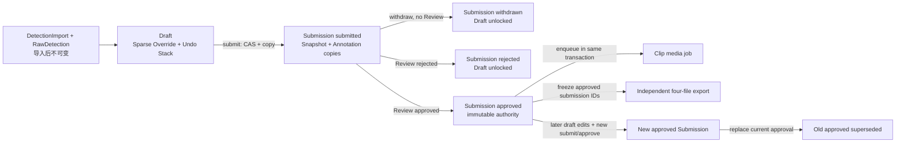
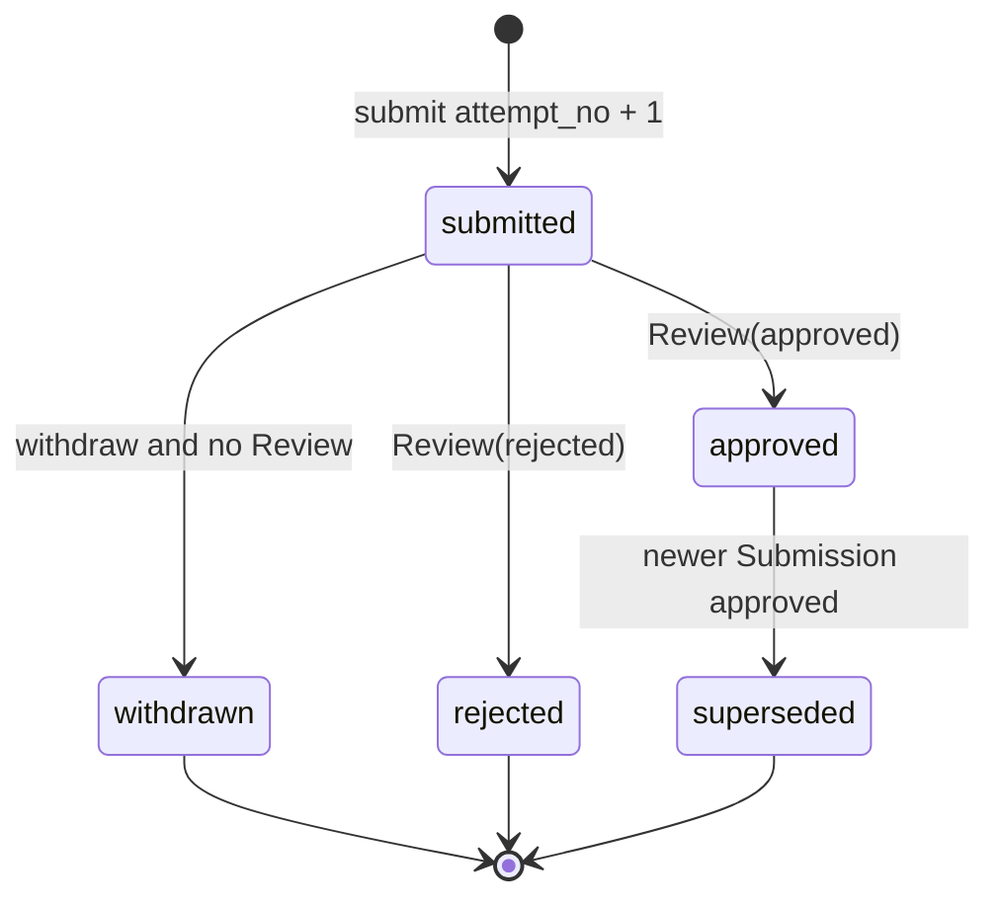

# 检测状态、提交审核与独立行为视频片段导出设计

> 状态：代码实现完成，待真实媒体与合并验收

> 0011 final remediation：raw baseline INSERT/UPDATE/DELETE 均由数据库 trigger 防护；Submission SHA-256 与 identity 绑定同一已打开 descriptor/Windows handle，锁内再复核当前路径；worker 从同一验证 handle 流式复制/hash 到 job 私有 staging，ffmpeg 只读 staging。0010 在 DDL 前以 frozen canonical helper 验证 pose metadata：名称非空唯一受控字符串，边恰含两个非 bool 整数且索引有效，禁止自环及无向重复。媒体时间参数保持 9 位小数。Phase 4 风险与范围不变。
> 日期：2026-08-11
> 对应工作项：WI-20260805-22

## 1. 状态、范围与目标

Phase 2 已将当前 draft 检测读取与 Split/Merge/Suppress/LIFO Undo 切换为 `RawDetection + DetectionStateOverride + DraftIdentityEdit/DraftDetectionChange`。Phase 3 已把 submit/withdraw/review、Review、new Clip/media job 和片段库新数据切换到不可变 `Submission + DetectionSnapshot + SubmissionAnnotation` authority；legacy Review/Clip 仍只读兼容，旧表未删除。Phase 4 独立四文件 ZIP 打包已实现；当前待真实媒体与合并验收。

本文把检测状态编辑、提交审核、媒体片段和独立行为视频片段导出统一为一套确定、可实施的设计。目标是：draft 编辑轻量且可并发保护；提交和审核读取不可变快照；导出与审核严格同源；每个已批准行为标注可导出为不依赖集中索引的自包含目录。

Gate 3 remediation 固定：source SHA-256 在 Video gate 外计算，gate 内仅复核 DB 修订/key
与文件 size+mtime_ns；snapshot 以 raw/state/metadata digest 防同 count 篡改；行为帧端点双
inclusive，媒体计划转换为半开区间 `[start/fps, (end+1)/fps)`，clip/thumbnail 共享 crop。
该纯计划是 Phase 4 track 坐标转换必须复用的时间/crop authority。

### 1.1 核心原则

1. `DetectionImport` 的导入元数据和 `RawDetection` 完成导入后不可变；`DetectionImport` 只允许 `active` 和 draft 工作游标 `edit_version`、`next_display_track_id` 变化。
2. 不复现每次 track 编辑后的完整历史状态。每次 edit/undo 只推进 `edit_version` 用于 CAS，不生成全量快照。
3. draft 可 Split、Merge、抑制和 LIFO undo；`submitted` 锁编辑，要继续编辑必须先 withdraw；`rejected` 解锁；`approved` 快照永不修改，后续修改形成新 draft。
4. 只在 submit 时创建或复用不可变 `DetectionSnapshot`，并复制不可变 `SubmissionAnnotation`。`Review` 绑定 `Submission`；Export 只读当前 `approved` Submission。
5. 当前检测状态采用稀疏 override：没有 `DetectionStateOverride` 行即 `display_track_id = RawDetection.raw_track_id` 且 `suppressed = false`。
6. effective raw/display track ID 统一满足 `0 <= id < 9223372036854775807`；`next_display_track_id` 游标满足 `0 <= cursor <= 9223372036854775807`。游标等于上界表示 ID 空间已耗尽，Phase 2 分配必须拒绝且不得再加 1。

### 1.2 状态与数据流



```text
effective draft = RawDetection LEFT JOIN DetectionStateOverride
submitted truth = DetectionSnapshot + DetectionSnapshotState + SubmissionAnnotation
reviewed/exported truth = current approved Submission and its immutable children
compatibility only = Video.status / Annotation.status projections
```

## 2. 目标 ORM 与数据库约束

以下是目标模型，不是当前 ORM 清单。所有时间使用项目统一 UTC 时间约定；布尔值和枚举在 ORM 与数据库层同时校验。SQLite 外键必须启用。

### 2.1 `DetectionImport`

保留现有字段、`active` 及现有唯一约束，新增：

| 字段 | 类型/默认 | 约束与语义 |
|---|---|---|
| `edit_version` | integer, default `0` | `CHECK (edit_version >= 0)`；每次 edit 或 undo 成功后加 1，作为 draft CAS 游标 |
| `next_display_track_id` | integer | `CHECK (0 <= next_display_track_id AND next_display_track_id <= 9223372036854775807)`；初始化为该 import 历史最大 display ID + 1 |

display track ID 只单调分配：Split 原子读取并递增 `next_display_track_id`；undo 和 Merge 均不回退游标，已分配 ID 永不复用。除 `active`、`edit_version`、`next_display_track_id` 外，导入完成后不得更新本表。

### 2.2 `RawDetection`

保留现有不可变检测字段。补充：

- `CHECK (frame_index >= 0)`；若现有检测序号字段名为 `detection_index`，增加 `CHECK (detection_index >= 0)`（迁移按实际现有列名落地，不新造同义列）。
- `CHECK (0 <= raw_track_id AND raw_track_id < 9223372036854775807)`；tracks JSONL 的首次导入与 replace 共用同一常量和输入校验，非法值在 ORM 写入前以 400 拒绝。
- 支撑同 import 复合外键：`UNIQUE (id, detection_import_id)`。
- 索引 `INDEX (detection_import_id, frame_index)`。
- 索引 `INDEX (detection_import_id, raw_track_id, frame_index)`。
- 导入完成后禁止业务更新。被 approved snapshot 间接引用的 import 不得删除；见第 2.6 节 RESTRICT 链。

### 2.3 `DetectionStateOverride`

| 字段 | 类型 | 约束与语义 |
|---|---|---|
| `raw_detection_id` | FK | PK；`ON DELETE CASCADE` |
| `detection_import_id` | FK | 非空；用于数据库级同 import 完整性 |
| `display_track_id` | integer | 非空，`CHECK (0 <= display_track_id AND display_track_id < 9223372036854775807)` |
| `suppressed` | boolean | 非空 |
| `updated_edit_version` | integer | 非空，`CHECK (updated_edit_version >= 1)` |

约束与索引：

- 复合 FK `(raw_detection_id, detection_import_id) -> RawDetection(id, detection_import_id) ON DELETE CASCADE`；不另设会绕过该约束的单列写路径。
- `CHECK (display_track_id <> raw baseline OR suppressed = true)` 不能直接跨表表达，由唯一写服务强制；恢复到 `raw_track_id + unsuppressed` baseline 时必须删除行，禁止保留无效 override。
- `INDEX (detection_import_id, display_track_id, suppressed)`：轨迹编辑、冲突检查和有效轨迹查询。
- `INDEX (detection_import_id, updated_edit_version)`：版本诊断和 shadow 校验。

### 2.4 draft 编辑栈

#### `DraftIdentityEdit`

| 字段 | 类型 | 约束与语义 |
|---|---|---|
| `id` | PK | 编辑 ID |
| `detection_import_id` | FK | 非空，`ON DELETE CASCADE` |
| `applied_edit_version` | integer | 非空，`CHECK (>= 1)`；`UNIQUE (detection_import_id, applied_edit_version)` |
| `operation` | enum | `split` / `merge` / `suppress_track` |
| `params` | JSON | 非空；只存 track ID、帧边界等紧凑参数，禁止存 detection ID 数组 |
| `operator_id` | FK user | 可空，`ON DELETE SET NULL` |
| `created_at` | datetime | 非空 |

索引 `INDEX (detection_import_id, applied_edit_version DESC)` 支持栈顶查询。它只是**当前 draft 的 LIFO undo 栈**，不是永久审计；批准后清空，迁移不伪造旧编辑历史。

#### `DraftDetectionChange`

| 字段 | 类型 | 约束与语义 |
|---|---|---|
| `edit_id` | FK | 复合 PK 第一列，`ON DELETE CASCADE` |
| `raw_detection_id` | FK | 复合 PK 第二列 |
| `detection_import_id` | FK | 非空；保证 edit、raw 属于同一 import |
| `before_override_exists` | boolean | 非空 |
| `before_display_track_id` | integer nullable | before override 存在时非空且 `>= 0`，否则必须空 |
| `before_suppressed` | boolean nullable | before override 存在时非空，否则必须空 |
| `after_override_exists` | boolean | 非空 |
| `after_display_track_id` | integer nullable | after override 存在时非空且 `>= 0`，否则必须空 |
| `after_suppressed` | boolean nullable | after override 存在时非空，否则必须空 |

数据库增加 `UNIQUE (id, detection_import_id)` 于 `DraftIdentityEdit`，并用复合 FK：

- `(edit_id, detection_import_id) -> DraftIdentityEdit(id, detection_import_id) ON DELETE CASCADE`；
- `(raw_detection_id, detection_import_id) -> RawDetection(id, detection_import_id) ON DELETE CASCADE`。

before/after 各自使用 CHECK 保证 `override_exists = false` 时两个值均为 NULL，`true` 时两值均非 NULL；只保存本次真正受影响的 detection。索引 `INDEX (detection_import_id, raw_detection_id)` 支持迁移验证和诊断。

### 2.5 提交检测快照

#### `DetectionSnapshot`

| 字段 | 类型 | 约束与语义 |
|---|---|---|
| `id` | PK | 快照 ID |
| `detection_import_id` | FK | 非空，`ON DELETE RESTRICT` |
| `source_edit_version` | integer | 非空，`CHECK (>= 0)` |
| `raw_detection_count` | integer | 非空，`CHECK (>= 0)` |
| `override_count` | integer | 非空，`CHECK (>= 0 AND override_count <= raw_detection_count)` |
| `schema_version` | integer | 非空，`CHECK (>= 1)` |
| `fps` | numeric | 非空，`CHECK (> 0)` |
| `width`, `height` | integer | 非空，`CHECK (> 0)` |
| `frame_count` | integer | 非空，`CHECK (>= 0)` |
| `keypoint_names` | JSON | 非空，数组 |
| `skeleton_edges` | JSON | 非空，数组 |
| `created_at` | datetime | 非空 |

`UNIQUE (detection_import_id, source_edit_version)`，并增加 `UNIQUE (id, detection_import_id)` 支撑子表复合 FK。相同 edit version 的重复提交复用快照；标注是否改变不影响复用。快照创建后禁止 UPDATE/DELETE。

#### `DetectionSnapshotState`

| 字段 | 类型 | 约束与语义 |
|---|---|---|
| `snapshot_id` | FK | 复合 PK 第一列，`ON DELETE RESTRICT` |
| `raw_detection_id` | FK | 复合 PK 第二列，`ON DELETE RESTRICT` |
| `detection_import_id` | FK | 非空；用于同 import 完整性 |
| `display_track_id` | integer | 非空，`CHECK (0 <= display_track_id AND display_track_id < 9223372036854775807)` |
| `suppressed` | boolean | 非空 |

提交时稀疏复制**全部当前 override**，baseline detection 不写行。复合 FK `(snapshot_id, detection_import_id) -> DetectionSnapshot(id, detection_import_id)` 与 `(raw_detection_id, detection_import_id) -> RawDetection(id, detection_import_id)` 保证 snapshot 和 raw 属于同一 import。索引 `INDEX (snapshot_id, display_track_id, suppressed)`。旧快照行禁止 UPDATE/DELETE；`ON DELETE RESTRICT` 使其不能因清理 raw/import 被级联破坏。

### 2.6 `Submission`

| 字段 | 类型 | 约束与语义 |
|---|---|---|
| `id` | PK | 提交 ID |
| `video_id` | FK | 非空，`ON DELETE RESTRICT` |
| `detection_snapshot_id` | FK | 非空，`ON DELETE RESTRICT` |
| `attempt_no` | integer | 非空，`CHECK (>= 1)` |
| `source_annotation_version` | integer | 非空，`CHECK (>= 0)` |
| `source_media_revision` | integer | 非空，`CHECK (>= 0)` |
| `source_video_filename` | string | 非空；提交时快照 |
| `source_storage_key` | string | 非空；服务端生成的受控相对 key |
| `source_video_sha256` | string | 非空；64 位小写十六进制 CHECK |
| `status` | enum | `submitted` / `withdrawn` / `approved` / `rejected` / `superseded` |
| `submitted_by` | FK user | 可空，`ON DELETE SET NULL` |
| `submitted_at` | datetime | 非空 |
| `decided_at` | datetime nullable | 终局 review 时写入；submitted/withdrawn 规则由状态 CHECK/服务层保证 |
| `legacy_backfill` | boolean | 非空，默认 false；标识尽最大可能回填的旧提交 |

约束与索引：

- `UNIQUE (video_id, attempt_no)`；attempt_no 在同一视频内单调加 1。
- 部分唯一索引 `UNIQUE (video_id) WHERE status = 'submitted'`，每视频最多一个待审核提交。
- 部分唯一索引 `UNIQUE (video_id) WHERE status = 'approved'`，每视频最多一个当前 approved；旧批准改为 `superseded`。
- `INDEX (detection_snapshot_id)`、`INDEX (status, submitted_at)`。
- `source_storage_key` 必须是标准化相对 key：禁止绝对路径、盘符、`..`、空段和反斜杠；只能由服务端受控存储层产生。key + SHA-256 必须能稳定定位并验证同一媒体，禁止接受客户端任意路径。

### 2.7 `SubmissionAnnotation`

| 字段 | 类型 | 约束与语义 |
|---|---|---|
| `id` | PK | 提交标注 ID |
| `submission_id` | FK | 非空，`ON DELETE CASCADE` |
| `source_annotation_id` | FK Annotation | 可空，`ON DELETE SET NULL` |
| `category_id` | FK category | 非空，`ON DELETE RESTRICT` |
| `category_name` | string | 非空；提交时名称快照，防止后续更名改变已审核/导出的行为名称 |
| `start_time`, `end_time` | numeric | 非空；`CHECK (start_time >= 0 AND end_time > start_time)` |
| `start_frame`, `end_frame` | integer | 非空；`CHECK (start_frame >= 0 AND end_frame >= start_frame)` |
| `confidence` | enum | `certain` / `uncertain` / `occluded` |
| `crop_region` | JSON nullable | `{x,y,w,h}`；存在时 `x,y >= 0`、`w,h > 0`，由 schema/服务层校验 |
| `mouse_ids` | JSON | 非空数字数组；提交时已按 snapshot 有效轨迹重校验 |

不保存 category group；导出目录只看具体 behavior category。增加 `INDEX (submission_id, category_id)`、`INDEX (category_id, submission_id)`，以及部分唯一索引 `UNIQUE (submission_id, source_annotation_id) WHERE source_annotation_id IS NOT NULL`，防止同一次提交重复复制同一源标注。提交副本创建后禁止业务更新。

### 2.8 `Review`

| 字段 | 类型 | 约束与语义 |
|---|---|---|
| `id` | PK | 审核 ID |
| `submission_id` | FK | 非空且 UNIQUE，`ON DELETE RESTRICT` |
| `reviewer_id` | FK user | 可空，`ON DELETE SET NULL` |
| `result` | enum | `approved` / `rejected` |
| `comment` | text nullable | 审核意见 |
| `created_at` | datetime | 非空 |

`Submission + DetectionSnapshot + SubmissionAnnotation` 是权威被审数据，`Review` 是唯一终局裁决。`Video.status`、`Annotation.status` 只作为兼容投影，不得反向成为审核或导出数据源。

### 2.9 `Clip`

确定改为关联 `submission_annotation_id`，且 `UNIQUE (submission_annotation_id)`，即每个提交标注最多一条当前实体视频片段记录：

| 字段 | 语义 |
|---|---|
| `submission_annotation_id` | FK `SubmissionAnnotation`, 非空，`ON DELETE CASCADE` |
| `status` | 片段任务状态（沿用项目受控枚举） |
| `clip_path` | 受控媒体相对路径，可空直到成功 |
| `thumbnail_path` | 内部缩略图相对路径，可空直到成功 |
| `error` | 失败摘要，可空 |
| `generated_at` | 成功生成时间，可空 |
| `created_at`, `updated_at` | 非空时间戳 |

删除旧冗余 `project_id`、`source_revision`、`media_revision`。提交快照不可变后，Clip 由 `submission_annotation_id` 唯一确定，无需 revision 隔离。内部片段库可继续使用缩略图，但新独立导出**不打包缩略图**。

### 2.10 `BackgroundJob`

可保留通用 job 表，但 payload 必须使用稳定权威引用：

- media job 引用 `submission_id` / `submission_annotation_id`，不得引用当前态 Annotation 或 revision。
- export job 在入队时冻结 submission IDs 和解析后的具体 category IDs；单/多类别目录判断使用这组类别 ID 的去重数量，不在 worker 执行时重新解析请求或 category group。
- approve 与 queued media job 的数据库记录必须在同一事务写入；事务 commit 后才调度 worker。ffmpeg、ffprobe、ZIP 均在事务外执行，不持有数据库写锁。

## 3. 现有 ORM 去留

| 当前/目标 ORM | 决定 | 切换后的职责 |
|---|---|---|
| `DetectionImport` | 保留并扩展 | 不可变导入元数据、active 和 draft 游标 |
| `RawDetection` | 保留并加强约束 | 不可变 raw baseline |
| `CorrectedTrack` | 删除 | 由 raw + sparse override 的有效 display track 取代 |
| 旧 `CorrectedDetectionAssignment` | 删除 | 不再每 revision 复制全量分配 |
| `DetectionSuppression` / `SuppressionDetection` | 删除 | `DetectionStateOverride.suppressed` 取代 |
| `IdentityEdit` | 替换 | `DraftIdentityEdit + DraftDetectionChange` 提供紧凑 LIFO undo |
| `DetectionStateOverride` | 新增 | 当前 draft 稀疏状态 |
| `DetectionSnapshot` / `DetectionSnapshotState` | 新增 | submit 时不可变稀疏检测快照 |
| `Submission` / `SubmissionAnnotation` | 新增 | 不可变被审数据与提交生命周期 |
| `Review` | 改造 | 唯一绑定 Submission 的终局裁决 |
| `Clip` | 改造 | 唯一绑定 SubmissionAnnotation 的实体片段 |

“删除”只指完成迁移、shadow 验证、读写切换并经过至少一个发布周期后的清理，不是当前立即删表，也不允许在切换前破坏回滚路径。

## 4. 关键查询与事务

### 4.1 `effective_detection_query`

统一查询必须显式选择两种 mode 之一：

- `draft(detection_import_id, expected_edit_version)`：先校验 import active、可编辑状态和 `edit_version == expected_edit_version`，再用 `RawDetection LEFT JOIN DetectionStateOverride`；`COALESCE(override.display_track_id, raw.raw_track_id)` 得到 display ID，`COALESCE(override.suppressed, false)` 得到抑制状态。
- `snapshot(snapshot_id)`：用 `RawDetection LEFT JOIN DetectionSnapshotState` 恢复该不可变快照，元数据取 `DetectionSnapshot`。

帧范围、display track 和 suppressed 条件都在 SQL 中完成。禁止先在 Python 构建大规模 suppressed detection ID set，也禁止巨型 `IN (...)`；分页/流式读取必须保持 SQL join 语义一致。

### 4.2 draft 状态门禁

可编辑条件是视频没有 `submitted` Submission；最近终局为 `rejected`、`withdrawn` 或没有提交时可编辑。已有 `approved` 不冻结后续 draft，但其快照保持不变；若同时存在新的 `submitted`，仍锁编辑。所有编辑写事务使用 SQLite 短事务 `BEGIN IMMEDIATE`、`expected_edit_version` CAS、唯一约束和必要索引。

Phase 2 兼容实现同时检查未来 `Submission(status=submitted)` 与当前 `Video.workflow_status=submitted`；命中时明确返回 409，Phase 3 withdraw 上线前不能编辑。成功编辑后 `Video.identity_revision` 与语义未变化 Annotation 的 `identity_revision` 仅作为 `DetectionImport.edit_version` 的兼容投影。

### 4.3 `split_track`

1. `BEGIN IMMEDIATE`；读取 active import，检查提交状态门禁与 `expected_edit_version` CAS。
2. 校验 source display track 在目标 split 帧区间有有效、未抑制 detection，参数只记录 source track、切分边界等紧凑值。
3. 原子取得 `next_display_track_id` 作为新 ID，并将游标加 1。
   若游标已经等于 `9223372036854775807`，必须拒绝分配且不得修改游标或其他 draft 状态。
4. 仅选择边界后受影响 detection，计算 before/after sparse state；写一条 `DraftIdentityEdit(operation=split, applied_edit_version=old+1)`、对应 delta，并 upsert/delete override（baseline 必须删行）。
5. 将 `edit_version` 从 old CAS 更新为 old+1；提交。失败整体回滚，新 ID 也不对外可见。

### 4.4 `merge_tracks`

1. `BEGIN IMMEDIATE`，执行门禁和 version CAS。
2. 校验两个有效、未抑制 display track 不同；按 frame 在 SQL 中检查同帧冲突。存在同帧两个 detection 时拒绝，不做隐式选择。
3. 明确保留一个 display ID，只修改另一轨上的受影响 detection；写紧凑 merge params、delta、override。
4. `edit_version + 1`。被合并 ID 不释放，`next_display_track_id` 不回退。

### 4.5 `suppress_track`

只接受当前有效且至少包含一个未抑制 detection 的 display track。保持每个 detection 的 effective display ID 不变，设置 `suppressed=true`，只写受影响 detection 的 before/after delta 和 sparse override，再令 `edit_version + 1`。不再创建 suppression 或 suppression-detection 表记录。

### 4.6 `undo_latest_edit`

1. `BEGIN IMMEDIATE`，执行可编辑门禁与 `expected_edit_version` CAS。
2. 只允许按 `applied_edit_version DESC` 取得当前栈顶；不得按任意 edit ID 撤销。
3. 按 `DraftDetectionChange.before_*` 恢复：before 不存在则删除 override，存在则恢复其 display ID/suppressed。
4. 删除栈顶 change/edit，`edit_version + 1`。不创建 undo 编辑记录，不回退 `next_display_track_id`，不复用 ID。

当前兼容 API 的 identity revert 与 suppression revert 都映射到该统一栈：传入 ID 必须等于栈顶 edit ID，且 endpoint 类型必须与栈顶 operation 匹配，否则返回 409。history/list 只展示当前 draft 栈，不再表示永久审计。

### 4.7 `submit`

同一 `BEGIN IMMEDIATE` 短事务内：

1. 验证没有 submitted Submission；CAS 当前 annotation version 与 `expected_annotation_version`，CAS import `edit_version` 与 `expected_edit_version`，并确认 source media revision 未变化。
2. 使用当前 effective detection 重校验全部 Annotation 的 `mouse_ids`、时间/帧范围与 crop；不得只信客户端值。
3. 按 `(detection_import_id, source_edit_version)` get-or-create `DetectionSnapshot`；创建时复制计数、媒体/姿态元数据和**全部当前 sparse override**。唯一冲突时读取既有快照并校验计数/schema。
4. 分配 `attempt_no = max + 1`，复制每条当前 Annotation 为新的不可变 `SubmissionAnnotation`；即使检测 edit version 未变，每次提交也重新复制标注。
5. 写入状态为 `submitted` 的 Submission 和媒体定位快照。事务中不执行 ffmpeg/ZIP。

### 4.8 `withdraw`

仅 submission 仍为 `submitted` 且不存在 Review 时，按 expected submission status/version 做 CAS 更新为 `withdrawn`。withdrawn 永不改回 submitted；继续流程必须创建 `attempt_no + 1` 的新 Submission。成功后 draft 解锁。

### 4.9 `review`

审核页面和事务只读目标 Submission 的 Snapshot 与 SubmissionAnnotation，不重新读取当前 Annotation/draft。

- `BEGIN IMMEDIATE` 后 CAS `status=submitted` 并依赖 `Review.submission_id UNIQUE` 防重复裁决。
- rejected：创建唯一 Review、将 Submission 置 `rejected` 并写 `decided_at`；draft 解锁，不改检测快照。
- approved：创建唯一 Review；将同视频旧 `approved` 先置 `superseded`，再将本次置 `approved` 并写 `decided_at`；清除该 import 当前已批准 draft 的 `DraftDetectionChange`/`DraftIdentityEdit` 栈，但不改 override、edit version 或 ID 游标；同事务写 queued media job。
- commit 后才 schedule worker。调度失败由持久 queued job 重试，不回滚已经提交的裁决；媒体生成失败不得篡改 Review。

### 4.10 `export`

入队时把显式请求冻结为完整合法 category IDs；仅空请求解析为当时 approved SubmissionAnnotation 实际 represented 的类别，筛选后无片段返回 400。任务同时冻结 Submission/SubmissionAnnotation/DetectionSnapshot 引用及类别/片段目录高熵 token。worker 只读这些不可变 authority，按第 6 节生成独立四文件目录。任一片段或校验失败，整包不发布；只有全部成功后才原子发布 ZIP。

## 5. 生命周期与边界



- 重复提交总是创建 `attempt_no + 1`；`rejected`/`withdrawn` 不改回 `submitted`。
- detection edit version 未变化时可复用 DetectionSnapshot；SubmissionAnnotation 每次重新复制。
- approved 后编辑当前 draft 不影响旧 snapshot；新 Submission approved 时旧 current approved 原子改为 superseded。
- LIFO undo 只操作 draft override，与已经提交的 immutable snapshot 不冲突。
- 媒体只能通过受控相对 storage key + SHA-256 稳定定位；禁止客户端任意路径。
- draft edit/change、用户、review comment、revision 等内部操作数据不导出。

## 6. 独立行为视频片段导出契约

本节契约已完成后端实现；因当前环境无 ffmpeg/ffprobe，25/30/60 FPS 真实媒体证据仍待验收，
在该证据完成前不得视为最终交付或 merge。入队时 approved、之后 superseded 的 Submission
因内容受 immutable trigger 保护，既有冻结任务允许完成；worker 不重选 current approved，
因此不会混入新版本。

### 6.1 批量目录结构

单类别/多类别按**入队时解析并冻结的本次请求具体 behavior category ID 去重数量**判断，忽略“个体行为”“社交行为”等上级 group：

- 仅一个具体类别：所有视频片段目录直接平铺在总目录。
- 多个具体类别：总目录先按每个具体 behavior category 建目录，再放视频片段目录。
- 每个 `SubmissionAnnotation` 恰好对应一个视频片段目录。

```text
# 单类别
export/
├── 攻击_video-a_000120-000180/
└── 攻击_video-b_000450-000510/

# 多类别
export/
├── 攻击/
│   └── 攻击_video-a_000120-000180/
└── 追逐/
    └── 追逐_video-c_000300-000390/
```

类别目录和片段目录名称须可读且文件系统安全；Windows device basename（包括 `CON.txt`）必须处理。名称经 NFKC/casefold 比较后循环去重，冲突后缀来自入队冻结的高熵随机 token，不使用可枚举数据库 ID 或其 hash，也不暴露标注者或审核人。

### 6.2 每个目录固定四文件

```text
视频片段目录/
├── clip.mp4
├── annotation.json
├── tracks.json
└── metadata.json
```

- `clip.mp4`：该 SubmissionAnnotation 对应的可独立播放片段。
- `annotation.json`：只含片段中的纯净行为数据。
- `tracks.json`：逐帧列出片段中全部未抑制可见小鼠及最终 display track ID。
- `metadata.json`：解释 clip、tracks、pose 与 source 定位。

目录中不增加缩略图或内部索引。

### 6.3 时间、帧、身份和坐标

- relative frame/time 均从 `0` 开始；`tracks.json` 每个数组元素严格对应 `clip.mp4` 一帧，空检测帧也必须保留。
- 每帧导出画面内**全部未抑制可见小鼠**，不只导出行为参与者。
- track ID 使用 approved DetectionSnapshot 恢复出的最终数字 display track ID，不重新编号；`annotation.json.mouse_ids` 使用同一语义。
- crop 后 `box` 和 `keypoints` 均转换为 `clip.mp4` 像素坐标（`clip_pixels`），并裁剪/校验到输出画幅约定。
- `annotation.json` 不含 DB ID、revision、用户、review、edit 或 undo 信息。
- `metadata.json` 使用 `clip`/`tracks`/`pose`/`source` 命名空间；source 只用于定位，保留源文件名、原始区间和 crop，不构成消费依赖。

### 6.4 `annotation.json`

行为标注覆盖整个导出片段，起始 frame/time 均为 0，结束值与 clip 末帧/时长一致。`confidence` 使用受控字符串枚举。

```json
{
  "behavior": "攻击",
  "mouse_ids": [1, 2],
  "confidence": "certain",
  "frame_range": {"start": 0, "end": 60},
  "time_range": {"start": 0.0, "end": 2.0}
}
```

### 6.5 `tracks.json`

简单逐帧 JSON 数组；`track_id`、`class_id` 为数字，并保留检测置信度字段名 `detection_confidence`。

```json
[
  {
    "frame": 0,
    "time": 0.0,
    "detections": [
      {
        "track_id": 1,
        "box": [120.0, 80.0, 220.0, 180.0],
        "keypoints": [[150.0, 100.0, 0.96], [170.0, 120.0, 0.91]],
        "detection_confidence": 0.95,
        "class_id": 0
      }
    ]
  },
  {
    "frame": 1,
    "time": 0.033333,
    "detections": []
  }
]
```

### 6.6 `metadata.json`

`crop_region` 固定为 `{x,y,w,h}` 对象；`source` 仅记录提交时冻结且经 hash 验证的源媒体定位语义，不输出 storage key 或服务器路径。

```json
{
  "schema_version": "1.0",
  "clip": {
    "filename": "clip.mp4",
    "fps": 30.0,
    "width": 640,
    "height": 480,
    "frame_count": 61
  },
  "tracks": {
    "frame_origin": 0,
    "time_origin": 0.0,
    "coordinate_system": "clip_pixels"
  },
  "pose": {
    "keypoint_names": ["nose", "left_ear"],
    "skeleton_edges": [[0, 1]]
  },
  "source": {
    "video_filename": "video-a.mp4",
    "start_frame": 120,
    "end_frame": 180,
    "start_time": 4.0,
    "end_time": 6.0,
    "crop_region": {"x": 100, "y": 50, "w": 640, "h": 480}
  }
}
```

### 6.7 明确不导出

- 顶层 manifest、集中式 `annotations.json` 或其他集中索引/汇总数据。
- 完整视频的行为标注时间线。
- 缩略图、源视频。
- 原始完整 `tracks.jsonl`、原始完整 `metadata.json`。
- 审计信息、标注者/审核者身份、Review、revision、draft edit 或 undo 历史。

### 6.8 四文件一致性与原子发布

- 四文件互相自洽；三个 JSON 必须先通过 schema 与业务校验。
- `tracks.json` 数组长度 = `metadata.json.clip.frame_count` = ffprobe 得到的 `clip.mp4` 实际帧数。
- relative frame/time 与 clip 对齐且从 0 开始；annotation end 与实际末帧/时长约定一致。
- `annotation.json.mouse_ids` 可在 tracks 的最终 display ID 语义下解释；允许参与鼠在部分帧不可见，但 ID 必须属于快照有效轨迹。
- box/keypoints 坐标对应 crop 后 clip 像素宽高；源区间、FPS、frame count 的舍入规则由同一裁剪计划产生，禁止各文件独立计算。
- 任一编码、轨迹恢复、JSON、ffprobe、ZIP 或一致性校验失败，整个请求失败，临时目录清理，不发布残缺 ZIP；全部片段通过后，用同文件系统临时文件 rename/replace 原子发布最终 ZIP。
- Snapshot 完整 digest 校验按 snapshot 去重并在最终发布锁外完成；最终短写锁内只复核任务 claim/payload、冻结引用与状态/identity、Clip ready 字段。tracks 的帧序、坐标、ID 和数值约束在逐帧写入时增量校验，validate 阶段禁止整文件 `read_text/json.loads`。
- Submission media worker 与 export 补生成共用同一 Clip CAS claim/wait；已为 `processing` 的 owner 不得被另一个 worker 覆盖或抢占。

## 7. 迁移与实现顺序

### 7.1 分阶段切换

1. **加法迁移**：创建新表、列、CHECK、复合 UNIQUE/FK 和索引，不删除旧表。
2. **严格预检并回填当前状态**：任何结构写入前先验证全部 legacy raw/display track ID 位于统一域；对每个 active import 的每条 RawDetection，所属 Video 当前 `identity_revision` 必须恰有一条 CDA，且 CorrectedTrack 必须存在、属于同一 import、`active=true`。missing CDA、missing track、cross-import track、inactive track 任一存在即按 import/video/revision/类别/计数硬失败，不允许 fallback 到 raw ID。预检通过后只用 validated inner join 计算 effective detection，并只写偏离 raw baseline 或 `suppressed=true` 的 override。
3. **shadow 对比**：同一 fixture 和真实样本同时运行 old/new effective query，逐 detection 对比 frame、raw ID、display ID、suppressed 与检测数据。
4. **切换写，再切换读**：停止旧模型写入后启用新事务；短期 shadow 读取，不长期双写。
5. **观察至少一个发布周期**：验证提交、审核、片段、导出和回滚备份。
6. **备份后删除旧表/列**：确认无回滚需求后清理 CorrectedTrack、旧 CDA、suppression 与旧 IdentityEdit 结构。

### 7.2 回填规则与 legacy 边界

- `next_display_track_id = 该 import 的 RawDetection.raw_track_id 与 CorrectedTrack.display_track_id 历史最大值 + 1`，空 import 为 `0`，避免复用。active import 若回填出至少一条 sparse override，则 `edit_version=1` 且所有回填行 `updated_edit_version=1`；active import 无 override 时保持 `edit_version=0`。inactive import 不生成 draft override、`edit_version=0`，但仍按历史最大 ID 回填 next cursor。该规则避免出现 `edit_version=0` 与 override 最小版本 `1` 的矛盾。
- suppression current-state 必须复刻 legacy revision 语义：原 operation 满足 `reverted_suppression_id IS NULL`、`base_identity_revision <= Video.identity_revision`，且不存在同 import、指向原 operation、`result_identity_revision <= Video.identity_revision` 的 revert row。即使已撤销 operation 的 SuppressionDetection 明细异常残留也不得回填；future-base 与 inactive import 同样不得进入 active draft override。
- 旧编辑历史不回填为可 undo；迁移后的 DraftIdentityEdit 栈为空。
- 当前 suppression revert 已物理删除 `SuppressionDetection`，旧 revision 作用域无法完整恢复。迁移只保证**当前有效状态**，必须在迁移报告和验证结果中明确此 legacy 边界，不得宣称恢复历史状态。
- 对当前 submitted/approved 数据尽最大可能回填 `legacy_backfill=true` 的 Submission。旧 Review 没有行为标注快照时，不能伪造完整 SubmissionAnnotation 历史；无法可靠重建者记录限制并保持 legacy 只读路径，不能以当前 Annotation 冒充当时被审数据。
- approved snapshot 通过 RESTRICT 链保护 RawDetection/DetectionImport。inactive import 清理前必须检查 snapshot 引用；有引用则保留，不得级联删除。

### 7.3 SQLite、媒体与回滚

- 所有状态写使用短 `BEGIN IMMEDIATE` + CAS + 唯一约束；查询使用第 2 节索引并用 `EXPLAIN QUERY PLAN` 验证关键路径。
- ffmpeg、ffprobe、JSON 大文件生成和 ZIP 均在数据库事务外进行，不持写锁。
- enqueue 与 approve 同事务，schedule 在 commit 后；worker 操作幂等并按稳定引用读取。
- 回滚依赖删旧表前的数据库和媒体备份。Alembic downgrade 只能撤销尚可逆的 schema 变化，不伪造已经丢失的旧 revision/suppression/edit 历史。
- 不长期双写；切换失败时停写、恢复备份或回到仍保留的旧读写路径。
- Phase 1 保留 legacy writer，因此 Phase 2 切换 writer 前必须进入维护窗口：停止相关写入，在单一明确事务内调用内部 reconciliation，严格重验 legacy current state，清空并重建 active import sparse override，重算所有 import 历史 next cursor，统一设置 edit_version，并确认 old/new shadow difference 为 0；失败整体回滚。该入口可重复调用但不暴露 public API，也不由当前业务自动调用。
- Phase 2 运行时所有 detection edit、Annotation create/update/delete、submit 与 detection replacement 必须竞争同一 Video no-op UPDATE 写门禁；获取后重读 active import、detection/edit/annotation revision 及 submitted 状态，SQLite busy/locked 对外统一为可重试 409。submitted 是硬锁，Annotation 与 replacement 不得通过 invalidation 隐式退回 draft。
- Phase 3 snapshot authority 落地前，current corrected export 只接受 active import 当前 `edit_version`；历史 import/revision 明确拒绝。Split/Merge/Suppress/Undo 的 detection delta/override 使用集合式 `INSERT ... SELECT`、批量 DELETE/INSERT，禁止逐 detection ORM；当前 JSONL 按 `(frame_index, frame_detection_index, raw_detection_id)` 稳定排序，以 `yield_per(500)` 和 `StringIO` 构造，Phase 4 再直接流式写文件。

### 7.4 YAGNI

本轮不做 event sourcing、任意 undo/redo、每 edit 全量 snapshot、detection IDs 巨型 JSON、`TrackPoint`、通用资产平台或集中导出索引。内部操作数据不进入独立导出。

## 8. 验证计划与 evidence path

本节是待执行验证计划，**当前未运行、不得写成测试已通过**。每项结果必须保存可复现命令、fixture/样本标识、摘要和失败差异，详细输出进入实现分支测试/迁移记录，工作项日志只记结论与 evidence path。

### 8.1 核心 claims

1. 新模型对迁移时 current active 状态的查询结果与旧查询等价。
2. 已提交旧 snapshot 不受后续 draft edit/undo 影响。
3. Review 与 Export 严格读取同一 Submission、DetectionSnapshot 和 SubmissionAnnotation。
4. 每个四文件目录脱离批次其他内容后仍可独立解释和消费。

### 8.2 最小实现门槛

| Evidence path | 必须证明 |
|---|---|
| migration fixture old/new diff | 回填前旧 effective detections 与回填后新查询逐 detection 等价；明确 legacy 历史不在 claim 内 |
| model/constraint tests | CHECK、复合 FK、部分唯一索引、RESTRICT/SET NULL/CASCADE 与 immutable service guard 生效 |
| draft state tests | Split、Merge、冲突帧拒绝、Suppress、仅栈顶 LIFO undo、baseline 删除 override、ID 不复用 |
| CAS concurrency tests | 两个编辑者、edit/submit 并发只有一个成功，失败方无部分 delta/override |
| lifecycle race tests | submit/edit、review/withdraw、双 review、两个 approve 竞态满足唯一状态和 attempt 规则 |
| snapshot reconstruction tests | sparse snapshot 可恢复全帧 effective state，含空帧、suppressed、raw baseline；新 edit 不改旧结果 |
| export contract tests | 单/多具体类别目录、固定四文件、数字 ID、confidence enum、crop pixels、无禁止字段 |
| failure publication tests | 任一编码/JSON/校验/ZIP 失败均无最终包；成功只出现一次完整原子发布 |

### 8.3 更强验证

- 用多个新旧真实样本做 shadow 比对，覆盖 inactive import、历史高 display ID、空帧、crop、多类别、旧 suppression 后又 revert 等可获得边界。
- 对 draft/snapshot effective query 执行 `EXPLAIN QUERY PLAN` 和规模化基准，确认不出现 Python 大 set、巨型 IN 或意外全表扫描。
- 使用真实 ffmpeg 生成 H.264 `clip.mp4`，以 ffprobe 校验帧数/尺寸/FPS/时长，再解包 ZIP；用只依赖片段目录的独立消费者解析三份 JSON、逐帧对齐轨迹并检查坐标。
- 注入 worker crash、重复调度、临时目录残留、同名目录、源 hash 不符和原子 rename 前失败，验证幂等、清理和不发布。
- 在迁移报告中单列：旧 suppression revert 已删除映射、旧 edit 不可 undo、旧 Review 无快照时无法恢复完整被审历史。这些是已知 legacy 限制，不得因 current-state 等价测试通过而隐藏。

## 9. 实施完成判定

只有在新 schema/事务/查询落地，迁移与最小门槛证据全部通过，真实样本 shadow 无未解释差异，审核和导出均已切到 immutable Submission，并完成至少一个发布周期观察后，才能把本文状态改为“已实现”。在此之前，当前实现和本文目标必须持续明确区分。
